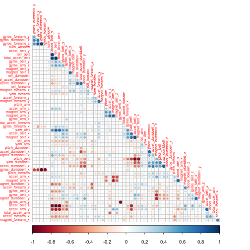

Practical Machine Learning: Course project
========================================================
First, we download the data from the proper URLs:


```r
#download.file("https://d396qusza40orc.cloudfront.net/predmachlearn/pml-training.csv", destfile="pml-training.csv", method="wget")
#download.file("https://d396qusza40orc.cloudfront.net/predmachlearn/pml-testing.csv", destfile="pml-testing.csv", method="wget")
```

Load the train data in R:


```r
training<-read.csv("pml-training.csv", header=TRUE, sep=",", na.strings = c("NA","#DIV/0!",""))
```

STEP 1: CHECK FOR MISSING DATA IN VARIABLES
===========================================

```r
mean(is.na(training))
```

```
## [1] 0.6132
```

There is a high percentage of observations (61.3184%) with missing data. Let's check how is missing data distributed among variables  


```r
percentColNAs<-sapply(names(training), function(c) mean((is.na(training[,c]))))
hist(percentColNAs)
```

 

```r
table(percentColNAs)
```

```
## percentColNAs
##                 0 0.979308938946081 0.979359902150647 0.979410865355213 
##                60                67                 1                 1 
## 0.979512791764346 0.979563754968912 0.979767607787178 0.979818570991744 
##                 1                 4                 1                 4 
##  0.97986953419631 0.980939761492203 0.983233105697686 0.983284068902253 
##                 2                 2                 1                 1 
## 0.983385995311385 0.983538884925084  0.98358984812965 0.983640811334217 
##                 2                 1                 4                 2 
##                 1 
##                 6
```

It seems that we have a extremes situation here: of the 160 variables, 60 have no missing values, and 100 have an extremely high proportion of missing values (6 even have no values at all). Should we remove the variables with a high proportion of missing values before attempting any model training? First, let's see if the absence or presence of data in these variables is informative (i.e.: linked with the outcome):  

```r
manyMissing<-percentColNAs[percentColNAs>0]
t<-training[,c(names(manyMissing),"classe")]
x<-t[,c(names(manyMissing[manyMissing!=1]),"classe")]
z<-data.frame(rowSums(x[,-95]),x[,95])
```

Proportion of each class in training data set:

```r
prop.table(table(training$classe))
```

```
## 
##      A      B      C      D      E 
## 0.2844 0.1935 0.1744 0.1639 0.1838
```

Proportion of each class in observations with missing values in suspicious variables:

```r
prop.table(table(z[!is.na(z[,1]),2]))
```

```
## 
##      A      B      C      D      E 
## 0.2488 0.2212 0.1705 0.1613 0.1982
```

Proportion of each class in observations without missing values in suspiciou variables:

```r
prop.table(table(z[is.na(z[,1]),2]))
```

```
## 
##      A      B      C      D      E 
## 0.2848 0.1932 0.1744 0.1639 0.1837
```

As we can see, proportions are similar  in all three cases, so we can infer that the fact that there are missing values in these variables or not is not linked with a specific outcome. We can safely remove them if NA values are a problem for the model chosen later.

STEP 2: CHECK FOR HIGHLY CORRELATED VARIABLES
=============================================
The existence of highly correlated variables may be problematic for some models, so let's check if there are any:


```r
library(corrplot)
trainingClean<-training[,names(percentColNAs[percentColNAs==0])]
c<-cor(trainingClean[,-c(1:6,60)])
corrplot(c, order="hclust", tl.cex=.6, type="lower", diag=FALSE)
```

 

The graph clearly shows several clusters of highly correlated variables, so we must keep this in mind if the chosen model is affected by this situation.

STEP 3: CHECK FOR LOW VARIANCE VARIABLES
========================================
Variables that have very low variance yield very little information and can be problematic for some models. Do we have any of these? Let's see:

```r
library(caret)
```

```
## Loading required package: lattice
## Loading required package: ggplot2
```

```r
nearZeroVar(trainingClean)
```

```
## [1] 6
```
It seems that variable 6 has very low variance, let's check its values:

```r
summary(trainingClean[,6])
```

```
##    no   yes 
## 19216   406
```

```r
prop.table(table(trainingClean[,6]))
```

```
## 
##      no     yes 
## 0.97931 0.02069
```

```r
table(trainingClean[,6],trainingClean$classe)
```

```
##      
##          A    B    C    D    E
##   no  5471 3718 3352 3147 3528
##   yes  109   79   70   69   79
```
So it has only two posible values, almost 98% of the values are "no", and the values do not seem correlated with the outcome, so this is a variable we could get rid of in case the chosen model is sensitive to low variance variables.

STEP 4: FIT THE MODEL
=====================
We choose to fit random forest model, using only the 60 variables without missing values and also excluding the first six variables, namely:
- X
- user_name
- raw_timestamp_part_1
- raw_timestamp_part_2
- cvtd_timestamp
- new_window

since they are contextual information about the data acquisition method and hence seem to be not appropriate for the problem at hand.

```r
set.seed(7)
inTrain <- createDataPartition(y=trainingClean$classe, p=0.7, list=FALSE)
modelTraining<-trainingClean[inTrain,]
modelTesting<-trainingClean[-inTrain,]
modFit <- train(classe~ .,data=modelTraining[,-c(1:6)],method="rf")
```

```
## Loading required package: randomForest
## randomForest 4.6-7
## Type rfNews() to see new features/changes/bug fixes.
```

```r
modFit
```

```
## Random Forest 
## 
## 13737 samples
##    53 predictors
##     5 classes: 'A', 'B', 'C', 'D', 'E' 
## 
## No pre-processing
## Resampling: Bootstrapped (25 reps) 
## 
## Summary of sample sizes: 13737, 13737, 13737, 13737, 13737, 13737, ... 
## 
## Resampling results across tuning parameters:
## 
##   mtry  Accuracy  Kappa  Accuracy SD  Kappa SD
##   2     1         1      0.001        0.002   
##   30    1         1      0.001        0.002   
##   50    1         1      0.003        0.003   
## 
## Accuracy was used to select the optimal model using  the largest value.
## The final value used for the model was mtry = 27.
```

```r
modFit$finalModel
```

```
## 
## Call:
##  randomForest(x = x, y = y, mtry = param$mtry) 
##                Type of random forest: classification
##                      Number of trees: 500
## No. of variables tried at each split: 27
## 
##         OOB estimate of  error rate: 0.28%
## Confusion matrix:
##      A    B    C    D    E class.error
## A 3904    1    0    0    1    0.000512
## B    6 2646    5    1    0    0.004515
## C    0    8 2387    1    0    0.003756
## D    0    0    7 2245    0    0.003108
## E    0    1    0    7 2517    0.003168
```

The model yields near perfect estimated accuracy. Are we overfitting? according to the original author, the estimation should be reliable and no cross-validation or test set are required, since it has been estimated during model building using the default bootstrapping technique with 25 repetitions in the training set, and the original authors of the random forest model states [in their paper](http://www.stat.berkeley.edu/~breiman/RandomForests/cc_home.htm#ooberr):  
"*In random forests, there is no need for cross-validation or a separate test set to get an unbiased estimate of the test set error*".
Anyway, let's see how well the model works with a test set and check if this estimated accuracy can live up to the expectations:


```r
pred<-predict(modFit, modelTesting[,-c(1:6)])
mean(pred==modelTesting$classe)
```

```
## [1] 0.9966
```

```r
table(pred,modelTesting$classe)
```

```
##     
## pred    A    B    C    D    E
##    A 1674    3    0    0    0
##    B    0 1134    1    0    0
##    C    0    2 1025    7    0
##    D    0    0    0  957    7
##    E    0    0    0    0 1075
```

As we can see, we obtain a 99.66% of accuracy in the test set, with only 20 misclassifications among 5885 samples. This is, as expected, in line with the near-perfect accuracy estimated with the training set, so we can infer a very high classification performance for this model.
